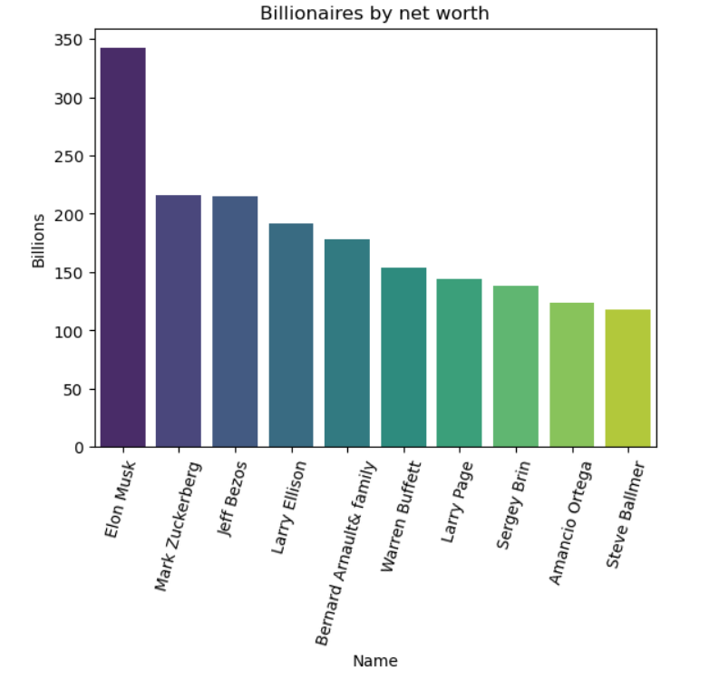

# Web-Scraping-Top-10-Billionaires

A beginner-friendly project **scraping the top 10 billionaires of 2025 from Wikipedia** and performing simple analysis to **practice web scraping, data handling, and visualization** in Python.

---

## About the Project

This project demonstrates the **end-to-end workflow** of web scraping and basic data analysis:

- **Scraping:** Extracting structured data from Wikipedia tables using `requests` and `BeautifulSoup`.  
- **Cleaning & Handling:** Organizing and processing data using `pandas`.  
- **Visualization:** Exploring the dataset through bar plots with `matplotlib` and `seaborn`.  
- **Output:** Saving a clean dataset to CSV and generating visual insights.  

Even with a small dataset (top 10 billionaires), this project highlights the **core skills required for real-world data projects**.

---

## Key Visualizations

### Billionaires by Age

### Billionaires by Net Worth

### Billionaires by Country

---

## Tools & Technologies

- **Languages:** Python 3.x  
- **Libraries:** `requests`, `BeautifulSoup`, `pandas`, `matplotlib`, `seaborn`  

---

## Dataset

- Scraped from [The World's Billionaires 2025 Wikipedia page](https://en.wikipedia.org/wiki/The_World%27s_Billionaires)  
- Columns include: Name, Age, Net Worth (USD), Nationality, and others  
- CSV file available: [billionaires.csv](billionaires.csv)

---

## Project Files

- **Full notebook with outputs:** [python-scraping.ipynb](python-scraping.ipynb)  
- **Clean Python script:** [python-code.md](python-code.md)  
- **Dataset:** [billionaires.csv](billionaires.csv)  

---

## Final Note

Turning a small dataset into meaningful insights — one step at a time.  

---

**Built by Akilla Kavinda Herath** – [GitHub](https://github.com/AkillerKavinda)
